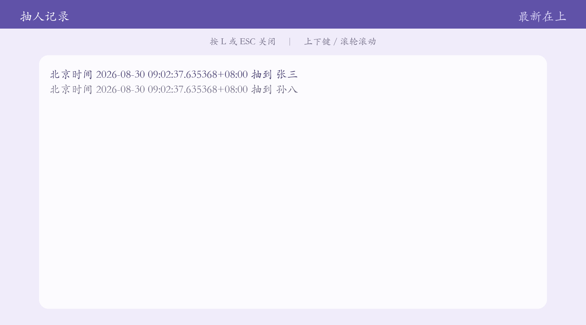

# 🎲 抽人 —— 课堂随机点名工具

一个用 Python + pygame 写的课堂随机点名小工具。老师输入要抽的人数，屏幕上名字滚动跳动，按空格定格，抽到谁谁就回答问题。支持**随机模式**和**轮次模式**（一个周期内每人只被抽一次）。

> 完全离线运行，无需联网；打包后无需安装 Python，双击即用。

---

## ✨ 功能特性

- 🎰 **滚动抽人动画**：名字在面板里跳动，按空格定格，仪式感拉满
- 🔁 **两种模式**：
  - **随机模式**：从剩余名单随机抽，抽空自动重置
  - **轮次模式**：一个周期内每人只被抽一次，记录跨重启保存（`picked.txt`），支持手动重置（R + Y 确认）
- 📖 **程序内日志查看**：按 `L` 打开抽人记录（北京时间），支持滚动
- 🔢 **主键盘 + 小键盘**均可输入数字（NumLock 开/关都有效）
- 🎵 **背景音乐**：按空格切换播放/静音，抽人更有氛围
- 📦 **免环境部署**：PyInstaller 自包含打包，Windows 10+ 双击即用

## 🖼️ 界面预览

| 准备界面 | 抽人界面 | 日志查看 |
|---|---|---|
|  |  |  |

## 🚀 快速开始

### 方式一：安装包（推荐分发）
运行 `installer/抽人_安装包_v1.0.0.exe`，按向导安装，自动创建开始菜单快捷方式（可选桌面快捷方式），支持卸载。

### 方式二：绿色版
解压 `main.zip`，双击 `点我/点我.exe` 即可运行。

### 方式三：源码运行
需要 Python 3.9+：

```bash
pip install pygame
python main.py
```

> **首次使用请先配置名单**：把 `name_list.example.txt` 重命名为 `name_list.txt`（或直接新建），每行写一个学生名字，UTF-8 编码。

## 🎮 使用说明

| 按键 | 功能 |
|---|---|
| `1`-`9` | 输入要抽的人数（主键盘/小键盘均可，最多 2 位） |
| `回车` | 开始抽人（人数需在 1-6 之间） |
| `空格` | 确定人选 / 继续抽下一批（同时切换背景音乐） |
| `M` | 切换 随机模式 ⇄ 轮次模式 |
| `R` | 重置本轮（轮次模式，按 `Y` 确认） |
| `L` | 打开/关闭日志查看窗口 |
| `↑↓` / `PgUp` `PgDn` / 滚轮 | 日志窗口滚动 |
| `ESC` | 退出程序 |

## 📁 数据文件

| 文件 | 说明 |
|---|---|
| `name_list.txt` | 学生名单，每行一个名字（UTF-8，空行忽略） |
| `log.txt` | 抽人记录，按北京时间追加，格式：`北京时间...抽到XX` |
| `picked.txt` | 轮次模式本轮已抽记录（自动生成，删除即开启新一轮） |

程序运行目录与文件位置：**所有数据文件都放在 exe 所在目录**，无论从哪个路径启动都能正确读写。

## 🔧 从源码构建

### 编译 exe（PyInstaller）

```bash
pyinstaller --noconfirm --clean --onedir --windowed --name 点我 --icon app.ico main.py
```

然后把资源文件复制到 `dist/点我/`：`STKAITI.TTF`、`background.png`、`music.mp3`、`name_list.txt`。

### 制作安装包（Inno Setup）

安装 [Inno Setup 6](https://jrsoftware.org/isinfo.php)，编译 `installer/抽人_安装包.iss` 即可生成安装包。

## 🛠 技术栈

- Python 3.9 · pygame 2.6
- PyInstaller 6（打包）
- Inno Setup 6（安装包）

## 📄 技术文档

详细的架构设计、数据格式、关键实现说明见 [docs/技术文档.md](docs/技术文档.md)。

## ⚠️ 版权声明

- 背景图、音乐、字体（STKAITI.TTF）版权归原作者所有，仅用于个人/教学演示
- 仓库中的 `name_list.txt` 为示例名单，使用时请替换为实际名单
